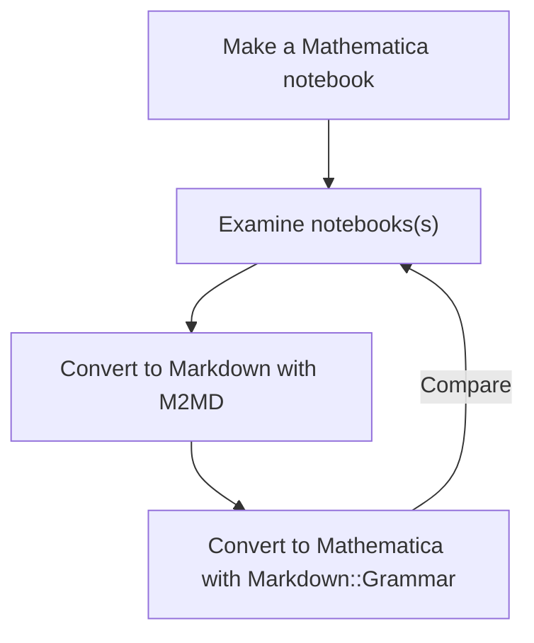

# Markdown::Grammar (Raku package)

## In brief

Markdown parser suitable for making converters of Markdown files into files of different kind of formats:
- [X] Mathematica notebook
- [ ] RMarkdown notebook 
- [ ] Jupyter notebook
- [X] Pod6 file
- [ ] Org-mode file

### Motivation

I am most interested in generating Mathematica and Jupyter notebooks from Markdown. 
Those notebook formats have syntax that is hard to evaluate the conversions visually. 
That is why I use Pod6 -- during development it is much easier to evaluate the Pod6 interpretations produced by the package. 
(I.e. no need to use another tool to open and evaluate the obtained conversion artifact.)

------

## Installation

From Zef ecosystem:

```shell
zef install Markdown::Grammar
```

From GitHub:

```shell
zef install https://github.com/antononcube/Raku-Markdown-Grammar.git
```

------

# Round trip translation

Consider the following round tripe translation experiment:

1. Make a Mathematica notebook

2. Convert WL notebook into Markdown file with the Mathematica package [M2MD](https://github.com/kubaPod/M2MD)

3. Convert the obtained Markdown file into Mathematica notebook using the Raku package "Markdown::Grammar"

4. Compare the notebooks


Here is the corresponding flowchart:



------

## Related work

### Pod6 to Markdown

- ["Raku::Pod::Render"](https://raku.land/zef:finanalyst/Raku::Pod::Render)

- ["Pod::To::Markdown"](https://raku.land/cpan:SOFTMOTH/Pod::To::Markdown)

### Markdown to HTML

- ["Markit"](https://raku.land/cpan:UZLUISF/Markit)

- ["Text::Markdown"](https://raku.land/zef:JJMERELO/Text::Markdown)

### Markdown to Pod6

*Except this 
["this package"](https://github.com/antononcube/Raku-Markdown-Grammar)
there are no other converters.*

### Jupyter to Markdown

- ["Jupyter"](https://jupyter.org) notebook interfaces have the option to be saved as Markdown files.

### Jupyter <-> Markdown

- ["jupytext"](https://jupytext.readthedocs.io/en/latest/install.html) allows the conversion 
  of Jupyter notebooks from and to Markdown.

- ["pandoc"](https://pandoc.org)allows the conversion
  of Jupyter notebooks from and to Markdown.

------

## Command line interface

The package provides a Command Line Interface (CLI) script, `from-markdown`. Here is its usage message:

```shell
>from-markdown --help
# Usage:
#  from-markdown [-t|--to=<Str>] [-o|--output=<Str>] <file> -- Converts Markdown files into Mathematica notebooks.
#  
#    <file>               Input file.
#    -t|--to=<Str>        Format to convert to. (One of 'mathematica' or 'pod6'.) [default: 'mathematica']
#    -o|--output=<Str>    Output file; if an empty string then the result is printed to stdout. [default: '']
```

------

## Usage example

Consider the following Markdown text:

```perl6
my $mtext = q:to/END/;
Here is data wrangling code:

    obj = dfTitanic;
    obj = GroupBy[ obj, #["passengerSex"]& ];
    Echo[Map[ Length, obj], "counts:"]

## References

### Articles

[AA1] Anton Antonov,
["Introduction to data wrangling with Raku"](https://rakuforprediction.wordpress.com/2021/12/31/introduction-to-data-wrangling-with-raku/),
(2021),
[RakuForPrediction at WordPress](https://rakuforprediction.wordpress.com).
END

say $mtext.chars;
```
```
# 410
```

Here is the corresponding Mathematica notebook:

```perl6
use Markdown::Grammar;

from-markdown($mtext, to => 'mathematica')
```
```
# Notebook[{Cell[TextData[{"Here", " ", "is", " ", "data", " ", "wrangling", " ", "code:"}], "Text"], Cell[ BoxData["    obj = dfTitanic;
#     obj = GroupBy[ obj, #[\"passengerSex\"]& ];
#     Echo[Map[ Length, obj], \"counts:\"]
# "], "Input"], Cell[TextData[{"References"}], "Section"], Cell[TextData[{""}]], Cell[TextData[{"Articles"}], "Subsection"], Cell[TextData[{""}]], Cell[TextData[{"[AA1]", " ", "Anton", " ", "Antonov,", " ", ButtonBox["\"Introduction to data wrangling with Raku\"", BaseStyle -> "Hyperlink", ButtonData -> { URL["https://rakuforprediction.wordpress.com/2021/12/31/introduction-to-data-wrangling-with-raku/"], None}], " ", ",", " ", "(2021),", " ", ButtonBox["RakuForPrediction at WordPress", BaseStyle -> "Hyperlink", ButtonData -> { URL["https://rakuforprediction.wordpress.com"], None}], " ", "."}], "Text"]}]
```

Here is the corresponding Pod6 text:

```perl6
from-markdown($mtext, to => 'pod6')
```
```
# =para
# Here is data wrangling code:
# =begin code
#     obj = dfTitanic;
#     obj = GroupBy[ obj, #["passengerSex"]& ];
#     Echo[Map[ Length, obj], "counts:"]
# =end code
# =begin head2
# References
# =end head2
# 
# =begin head3
# Articles
# =end head3
# 
# =para
# [AA1] Anton Antonov,
# L<"Introduction to data wrangling with Raku"|https://rakuforprediction.wordpress.com/2021/12/31/introduction-to-data-wrangling-with-raku/> ,
# (2021),
# L<RakuForPrediction at WordPress|https://rakuforprediction.wordpress.com> .
```

------

## TODO

The most important items are placed first.

- [ ] Parsing bold, italic, code "phrases."

- [ ] Parsing blocks with bold, italic formatting specs
  
- [ ] Parsing code blocks given with indentation.

- [ ] Parsing and interpretation of "deferred" links. E.g. `[![enter image description here][1]][1]`.

   - This might be fairly complicated, needing a "second pass" interpreter.  
   
- [ ] Parsing tables

------

## References

[JP1] Jakub Podkalicki,
[M2MD](https://github.com/kubaPod/M2MD),
[GitHub/kubaPod](https://github.com/kubaPod).

