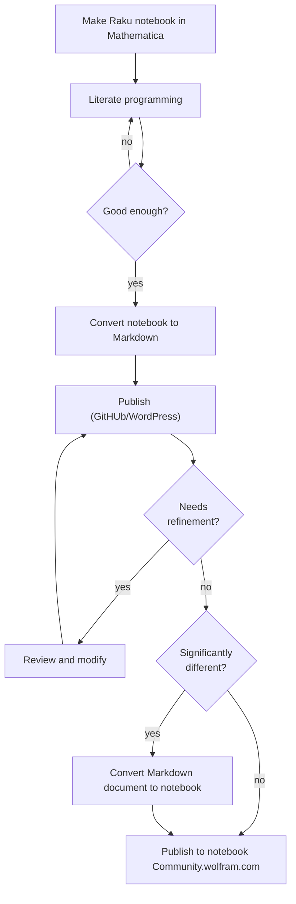

# Raku Markdown::Grammar

## In brief

Markdown parser suitable for making converters of Markdown files into files of different kind of formats:
- [X] DONE Mathematica notebook
- [ ] TODO RMarkdown notebook
- [X] DONE Jupyter notebook
- [X] DONE Pod6 file
- [X] DONE Org-mode file
- [X] DONE HTML file
- [X] DONE Raku data structure 

See the video 
["Markdown to Mathematica converter (CLI and StackExchange examples)"](https://www.youtube.com/watch?v=39ekokgnoqE), [AAv1],
for a (quick, 7.5 min) demo. 
The video [AAv2] shows the conversion of a Jupyter notebook into a Mathematica notebook via Markdown representation.
The video [AAv3] shows conversions to POD6, Mathematica, and Jupyter and evaluations of those documents.
(The evaluations are done with 
["Text::CodeProcessing"](https://raku.land/zef:antononcube/Text::CodeProcessing), [AAp1].)

### Motivation

#### Mathematica notebooks

I am most interested in generating Mathematica notebooks from Markdown. 

I have written a fair amount of Raku-related Markdown documents. Many of those Markdown documents
were generated from Mathematica notebooks using 
[M2MD](https://github.com/kubaPod/M2MD), [JPp1]. 
But of course, most of the time, further changes and embellishments were made over those Markdown documents. 
Hence it would be very nice to be able to go back to Mathematica.

**Remark:** Raku can be used in Mathematica via the so called `RakuMode` -- see [AA1].

**Remark:** Markdown documents with Raku code cells can be evaluated with Command Line Interface (CLI)
scripts of the package 
["Text::CodeProcessing"](https://raku.land/cpan:ANTONOV/Text::CodeProcessing), [AAp1]. 
For more details see the article 
["Connecting Mathematica and Raku"](https://rakuforprediction.wordpress.com/2021/12/30/connecting-mathematica-and-raku/), [AA1].

Here is a flowchart that gives better idea of the workflow outlined above:



#### Pod6

The notebook formats have syntax that makes it hard to evaluate the conversions visually. 
That is why I use Pod6 -- during development it is much easier to evaluate the Pod6 interpretations 
produced by the package. 
(I.e. no need to use another tool to open and evaluate the obtained conversion artifact.)

------

## Installation

From Zef ecosystem:

```
zef install Markdown::Grammar
```

From GitHub:

```
zef install https://github.com/antononcube/Raku-Markdown-Grammar.git
```

------

## Round trip translation

Consider the following round trip translation experiment:

1. Make a Mathematica notebook

2. Convert WL notebook into Markdown file with the Mathematica package [M2MD](https://github.com/kubaPod/M2MD)

3. Convert the obtained Markdown file into Mathematica notebook using the Raku package "Markdown::Grammar"

4. Compare the notebooks


Here is the corresponding flowchart:


------

## Related work

Here is a table of converters from- or to Markdown:

| From \ To   | HTML                                                                                                                                                                                                                     | Jupyter                                                                                                               | Markdown                                                                    | Mathematica                                                                                                                                                                    | Pod6                                                                     | Org-mode                                                                                               | Raku                                                                     |
|-------------|--------------------------------------------------------------------------------------------------------------------------------------------------------------------------------------------------------------------------|-----------------------------------------------------------------------------------------------------------------------|-----------------------------------------------------------------------------|--------------------------------------------------------------------------------------------------------------------------------------------------------------------------------|--------------------------------------------------------------------------|--------------------------------------------------------------------------------------------------------|--------------------------------------------------------------------------|
| HTML        |                                                                                                                                                                                                                          | [pandoc](https://pandoc.org)                                                                                          | [pandoc](https://pandoc.org)                                                |                                                                                                                                                                                |                                                                          | [pandoc](https://pandoc.org)                                                                           |                                                                          |
| Jupyter     | [Jupyter](https://jupyter.org)                                                                                                                                                                                           |                                                                                                                       | [Jupyter](https://jupyter.org), [jupytext](https://jupytext.readthedocs.io) |                                                                                                                                                                                |                                                                          |                                                                                                        |                                                                          |
| Markdown    | [pandoc](https://pandoc.org), [Markit](https://raku.land/cpan:UZLUISF/Markit), [Text::Markdown](https://raku.land/zef:JJMERELO/Text::Markdown), [Markdown::Grammar](https://raku.land/zef:antononcube/Markdown::Grammar) | [jupytext](https://jupytext.readthedocs.io), [Markdown::Grammar](https://raku.land/zef:antononcube/Markdown::Grammar) |                                                                             | [Markdown2WL](https://github.com/dishmint/Markdown2WL), [md2nb](https://github.com/ConnorGray/md2nb), [Markdown::Grammar](https://raku.land/zef:antononcube/Markdown::Grammar) | [Markdown::Grammar](https://raku.land/zef:antononcube/Markdown::Grammar) | [pandoc](https://pandoc.org), [Markdown::Grammar](https://raku.land/zef:antononcube/Markdown::Grammar) | [Markdown::Grammar](https://raku.land/zef:antononcube/Markdown::Grammar) |
| Mathematica |                                                                                                                                                                                                                          |                                                                                                                       | [M2MD](https://github.com/kubaPod/M2MD)                                     |                                                                                                                                                                                |                                                                          |                                                                                                        |                                                                          |
| Pod6        |                                                                                                                                                                                                                          |                                                                                                                       | [Pod::To::Markdown](https://raku.land/cpan:SOFTMOTH/Pod::To::Markdown)      |                                                                                                                                                                                |                                                                          |                                                                                                        |                                                                          |
| Org-mode    | [pandoc](https://pandoc.org), [Org-mode](https://orgmode.org)                                                                                                                                                            |                                                                                                                       | [pandoc](https://pandoc.org), [Org-mode](https://orgmode.org)               |                                                                                                                                                                                |                                                                          |                                                                                                        |                                                                          |


**Remark:** [Pandoc](https://pandoc.org) attempts to be an universal converter, applicable for all couples of formats.

**Remark:** Except 
["this package"](https://github.com/antononcube/Raku-Markdown-Grammar)
there are no other converters from Markdown to 
[Pod6](https://docs.raku.org/language/pod).

**Remark:** In general I like the idea of a Markdown-to-Mathematica converter written in Mathematica.
The package 
["Markdown2WL"](https://github.com/dishmint/Markdown2WL) 
attempts that, but unfortunately it is fairly incomplete.

**Remark:** When starting this project I did not know about Connor's package 
["md2nb"](https://github.com/ConnorGray/md2nb). (Written in Rust.)
If I knew about it, most likely, I would have not written this package.

------

## Command line interface

The package provides a Command Line Interface (CLI) script, `from-markdown`. Here is its usage message:

```shell
from-markdown --help
```
```
# Usage:
#   from-markdown <text> [-f|--flavor=<Str>] [-t|--to=<Str>] [-l|--default-language=<Str>] [-r|--raku-code-cell-name=<Str>] [-d|--docked-cells] [-o|--output=<Str>] -- Converts Markdown files into Jupyter and Mathematica notebooks, and HTML, Org-mode, and Pod6 files.
#   
#     <text>                            Input file or Markdown text.
#     -f|--flavor=<Str>                 Markdown flavor. (One of 'obsidian' or 'Whatever'.) [default: 'Whatever']
#     -t|--to=<Str>                     Format to convert to. (One of 'html', 'jupyter', 'mathematica', 'org', 'pod6', or 'Whatever'.) [default: 'Whatever']
#     -l|--default-language=<Str>       Default code blocks language. [default: 'Whatever']
#     -r|--raku-code-cell-name=<Str>    Raku code cell name. (Mathematica only.) [default: 'Whatever']
#     -d|--docked-cells                 Should formula conversion button be added as a docked cell or not? (Mathematica only.) [default: False]
#     -o|--output=<Str>                 Output file; if an empty string then the result is printed to stdout. [default: '']
```

The CLI script `from-markdown` takes both file names and (Markdown) text. Here is an usage example for the latter:

```shell
from-markdown -to=pod6 'Here is data wrangling code:

    obj = dfTitanic;
    obj = GroupBy[ obj, #["passengerSex"]& ];  
    Echo[Map[ Length, obj], "counts:"]

## References'
```
```
# =begin pod
# =begin para
# Here is data wrangling code:
# =end para
# =begin code
# obj = dfTitanic;
# obj = GroupBy[ obj, #["passengerSex"]& ];  
# Echo[Map[ Length, obj], "counts:"]
# =end code
# =begin head2
# References
# =end head2
# =end pod
```

**Remark:** Using the CLI script with the option setting `--raku-cell-code-name=RakuInputExecute` produces
Raku cells that require the Mathematica package "RakuMode.m", [AAp2], to be loaded and the command `RakuMode[]` 
to be executed in the result notebook. 

**Remark:** If CLI script's argument `--output` is a non-empty string and `--format` is "whatever" or "automatic",
then an attempt is made to conclude the format to convert to from the extension of the file name given to `--output`.


------

## Usage examples

### Conversion of text

Consider the following Markdown text:

```perl6
my $mtext = q:to/END/;
Here is data wrangling code:

    obj = dfTitanic;
    obj = GroupBy[ obj, #["passengerSex"]& ];
    Echo[Map[ Length, obj], "counts:"]

## References

### Articles

[AA1] Anton Antonov,
["Introduction to data wrangling with Raku"](https://rakuforprediction.wordpress.com/2021/12/31/introduction-to-data-wrangling-with-raku/),
(2021),
[RakuForPrediction at WordPress](https://rakuforprediction.wordpress.com).
END

say $mtext.chars;
```
```
# 410
```

Here is the corresponding Mathematica notebook:

```perl6
use Markdown::Grammar;

from-markdown($mtext, to => 'mathematica')
```
```
# Notebook[{Cell[TextData[{"Here", " ", "is", " ", "data", " ", "wrangling", " ", "code:"}], "Text"], Cell[ BoxData["obj = dfTitanic;
# obj = GroupBy[ obj, #[\"passengerSex\"]& ];
# Echo[Map[ Length, obj], \"counts:\"]
# "], "Input"], Cell[TextData[{"References"}], "Section"], Cell[TextData[{"Articles"}], "Subsection"], Cell[TextData[{"[AA1]", " ", "Anton", " ", "Antonov,", " ", ButtonBox["\"Introduction to data wrangling with Raku\"", BaseStyle -> "Hyperlink", ButtonData -> { URL["https://rakuforprediction.wordpress.com/2021/12/31/introduction-to-data-wrangling-with-raku/"], None}], " ", ",", " ", "(2021),", " ", ButtonBox["RakuForPrediction at WordPress", BaseStyle -> "Hyperlink", ButtonData -> { URL["https://rakuforprediction.wordpress.com"], None}], " ", "."}], "Text"]}]
```

Here is the corresponding Pod6 text:

```perl6
from-markdown($mtext, to => 'pod6')
```
```
# =begin pod
# =begin para
# Here is data wrangling code:
# =end para
# =begin code
# obj = dfTitanic;
# obj = GroupBy[ obj, #["passengerSex"]& ];
# Echo[Map[ Length, obj], "counts:"]
# =end code
# =begin head2
# References
# =end head2
# 
# =begin head3
# Articles
# =end head3
# 
# =para
# [AA1] Anton Antonov,
# L<"Introduction to data wrangling with Raku"|https://rakuforprediction.wordpress.com/2021/12/31/introduction-to-data-wrangling-with-raku/> ,
# (2021),
# L<RakuForPrediction at WordPress|https://rakuforprediction.wordpress.com> .
# =end pod
```

### Section tree

The function `md-section-tree` extracts the Markdown blocks into a Hash-based tree that 
corresponds to the hierarchical sections structure of the Markdown document:

```perl6, results=asis
use Data::Translators;
md-section-tree($mtext) ==> data-translation(field-names => <type level name content>)
```
<table border="1"><thead><tr><th>type</th><th>level</th><th>name</th><th>content</th></tr></thead><tbody><tr><td>md-text-block</td><td>7</td><td>(Whatever)</td><td>Here is data wrangling code:
</td></tr><tr><td>md-code-indented-block</td><td>7</td><td>(Whatever)</td><td>
    obj = dfTitanic;
    obj = GroupBy[ obj, #[&quot;passengerSex&quot;]&amp; ];
    Echo[Map[ Length, obj], &quot;counts:&quot;]

</td></tr><tr><td>md-header2</td><td>2</td><td>References</td><td>## References
</td></tr><tr><td>md-text-block</td><td>7</td><td>(Whatever)</td><td>
</td></tr><tr><td>md-header3</td><td>3</td><td>Articles</td><td>### Articles
</td></tr><tr><td>md-text-block</td><td>7</td><td>(Whatever)</td><td>
[AA1] Anton Antonov,
[&quot;Introduction to data wrangling with Raku&quot;](https://rakuforprediction.wordpress.com/2021/12/31/introduction-to-data-wrangling-with-raku/),
(2021),
[RakuForPrediction at WordPress](https://rakuforprediction.wordpress.com).
</td></tr></tbody></table>


Here we just get the code blocks:

```perl6
md-section-tree($mtext, modifier => 'code')
```
```
# [
#     obj = dfTitanic;
#     obj = GroupBy[ obj, #["passengerSex"]& ];
#     Echo[Map[ Length, obj], "counts:"]
# 
# ]
```

------

## Parsing Markdown flavors

### Obsidian 

The parsing and interpretation of Obsidian flavor Markdown files is specified with the option "flavor".
Here is an invocation within a Raku session:

```
from-markdown($mtext2, flavor => 'obsidian', to => 'jupyter');
```

Here is one of the ways to specify Obsidian file conversion via the CLI script:

```
from-markdown myObsidianFile.md -f=obsidian -o myObsidianFile.ipynb  
```

Other examples are given in the test file 
["07-Jupyter-Obsidian.rakutest"](https://github.com/antononcube/Raku-Markdown-Grammar/blob/main/t/07-Jupyter-Obsidian.rakutest).

See also the dedicated GitHub repository: ["obsidian-2-jupyter"](https://github.com/rcmlz/obsidian-2-jupyter), [RMr1].

------

## TODOs

The most important items are placed first.

- [X] DONE Parsing bold, italic, code "words."

- [ ] TODO Parsing bold, italic, code "phrases."

- [X] DONE Parsing blocks with bold, italic formatting specs
  
- [X] DONE Parsing code blocks given with indentation.

- [X] DONE Parsing and interpretation of "deferred" links. E.g. `[![enter image description here][1]][1]`.

   - This is somewhat complicated, needing a "second pass" interpreter.
   - The "second pass" is handled in the TOP action methods.
   
- [X] DONE Parsing quote lines and quote blocks

- [X] DONE Parsing tables

- [X] DONE Parsing LaTeX and/or [math blocks](https://github.com/fletcher/MultiMarkdown/wiki/MultiMarkdown-Syntax-Guide#math-support) 

- [X] DONE Parsing inlined LaTeX code.

- [X] DONE Parsing LaTeX code with a docked cell button in the generated Mathematica notebook.

- [X] DONE Have option(s) for default language for code cells.

- [X] DONE Have option(s) for Raku code cell name.

- [ ] TODO Have option(s) for skipping horizontal line specs.

- [ ] TODO Parsing alternate syntax for heading 1 and 2

- [ ] TODO Parsing escaping characters

- [ ] TODO Parsing HTML

- [ ] TODO Parsing most or all of the elements of the [extended syntax](https://www.markdownguide.org/extended-syntax/), [MC1] 


------

## Acknowledgments

Many thanks to Jakub (Kuba) Podkalicki for programming the package "M2MD", and helping me to understand
a fair amount of Mathematica's 
[low-Level notebook programming](https://reference.wolfram.com/language/guide/LowLevelNotebookProgramming.html).

Thanks to Rc Mlz for his request and guidance for parsing the Obsidian Markdown flavor and 
creating the dedicated [Obsidian-to-Jupyter conversion repository](https://github.com/rcmlz/obsidian-2-jupyter), [RMr1].

------

## References

### Articles

[AA1] Anton Antonov,
["Connecting Mathematica and Raku"](https://rakuforprediction.wordpress.com/2021/12/30/connecting-mathematica-and-raku/),
(2021),
[RakuForPrediction at WordPress]([https://rakuforprediction.wordpress.com/).

[FZ1] Faizon Zaman,
["Parsing markdown files"](https://community.wolfram.com/groups/-/m/t/2142852),
(2021),
[Community.wolfram.com](https://community.wolfram.com).

### Guides

[JG1] John Gruber, [Markdown: Syntax](https://daringfireball.net/projects/markdown/).

[MC1] Matt Cone, [Markdown Guide](https://www.markdownguide.org).

[RC1] Raku Community, [Raku Pod6](https://docs.raku.org/language/pod).

### Packages, paclets

[AAp1] Anton Antonov
[Text::CodeProcessing Raku package](https://github.com/antononcube/Raku-Text-CodeProcessing),
(2021-2022),
[GitHub/antononcube](https://github.com/antononcube).

[AAp2] Anton Antonov
[RakuMode Wolfram Language paclet](https://resources.wolframcloud.com/PacletRepository/resources/AntonAntonov/RakuMode/),
(2023),
[Wolfram Language Paclet Repository](https://resources.wolframcloud.com/PacletRepository).

[FZp1] Faizon Zaman,
[Markdown2WL Mathematica package](https://github.com/dishmint/Markdown2WL),
(2021),
[GitHub/dishmint](https://github.com/dishmint/Markdown2WL).

[JPp1] Jakub Podkalicki,
[M2MD](https://github.com/kubaPod/M2MD),
(2018-2022),
[GitHub/kubaPod](https://github.com/kubaPod).

[RMr1] Rc Mlz,
[obsidian-2-jupyter](https://github.com/rcmlz/obsidian-2-jupyter),
(2024),
[GitHub/rcmlz](https://github.com/rcmlz).

### Videos

[AAv1] Anton Antonov,
["Markdown to Mathematica converter (CLI and StackExchange examples)"](https://www.youtube.com/watch?v=39ekokgnoqE),
(2022),
[Anton A. Antonov's channel at YouTube](https://www.youtube.com/channel/UC5qMPIsJeztfARXWdIw3Xzw).

[AAv2] Anton Antonov,
["Markdown to Mathematica converter (Jupyter notebook example)"](https://www.youtube.com/watch?v=Htmiu3ZI05w),
(2022),
[Anton A. Antonov's channel at YouTube](https://www.youtube.com/channel/UC5qMPIsJeztfARXWdIw3Xzw).

[AAv3] Anton Antonov,
["Conversion and evaluation of Raku files"](https://www.youtube.com/watch?v=GJO7YqjGn6o),
(2022),
[Anton A. Antonov's channel at YouTube](https://www.youtube.com/channel/UC5qMPIsJeztfARXWdIw3Xzw).